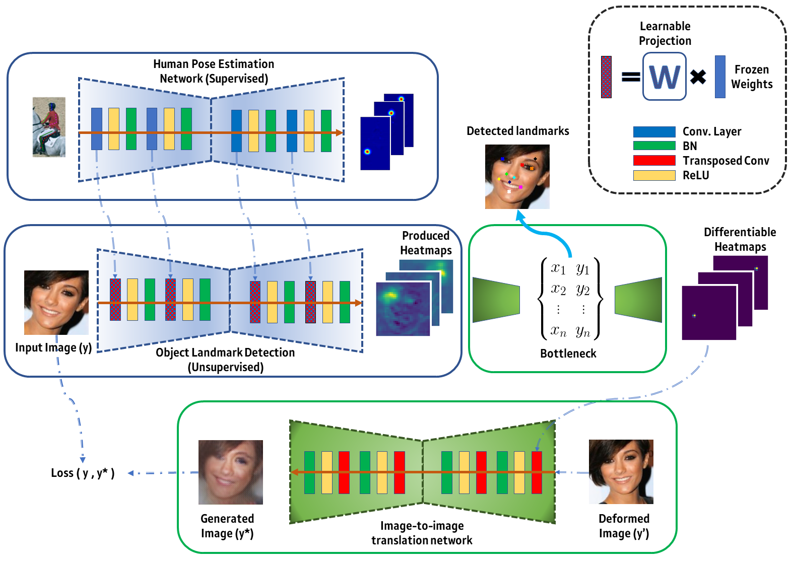

# [](https://research.samsung.com/aicenter_cambridge)
## Object landmark discovery through unsupervised adaptation (NeurIPS2019) [paper](https://papers.nips.cc/paper/9505-object-landmark-discovery-through-unsupervised-adaptation.pdf)



[Enrique Sanchez](http://esanchezlozano.github.io), [Georgios Tzimiropoulos](http://www.cs.nott.ac.uk/~pszyt/)

## License

Copyright © 2019, SAMSUNG R&D Institute UK. All Rights Reserved.

<a rel="license" href="http://creativecommons.org/licenses/by-nc/4.0/"></a><br />This work is licensed under a <a rel="license" href="http://creativecommons.org/licenses/by-nc/4.0/">Creative Commons Attribution-NonCommercial 4.0 International License</a>.

All the material, including source code, is made freely available for non-commercial use under the Creative Commons CC BY-NC 4.0 license. Feel free to use any of the material in your own work, as long as you give us appropriate credit by mentioning the title and author list of our paper.

All the third-party libraries (Python, PyTorch, Torchvision, Numpy, OpenCV, Visdom, Torchnet, GPUtil and SciPy) are owned by their respective authors, and must be used according to their respective licenses. 

## Requirements
* Linux
* Python 3.6 or further 
* PyTorch 1.X with torchvision
* Numpy
* OpenCV (cv2)

For visualization, the code above uses [Visdom](https://github.com/facebookresearch/visdom), through its wrapper [TorchNet](https://github.com/pytorch/tnt). You can alternatively disable the visualization by setting --visdom False when running the code. No source code would be needed in that case. 

This code assigns a CUDA device directly based on availability, with [GPUtil](https://github.com/anderskm/gputil). This option can be disabled by setting --cuda to the target GPU device. Again, no need to have GPUtil installed in such case.

### Data

The data used to train the models is CelebA, which was obtained from [here](http://www.robots.ox.ac.uk/~vgg/research/unsupervised_landmarks/resources/celeba.zip). It also includes the training and test partitions of MAFL. We excluded the MAFL test partition for the unsupervised training. For the unsupervised training, a bounding box is first obtained to crop the images. The bounding box is computed from the landmarks provided in the CelebA dataset.  
You must copy the file ``list_landmarks_align_celeba.txt"" to the repo's path.

The AFLW, used for validation, can be found [here](http://www.robots.ox.ac.uk/~vgg/research/unsupervised_landmarks/resources/aflw_release-2.zip). 

### Training

To train a model using the same hyperparameters as those in the paper just run
```
>> python train.py --data_path path/to/celeba
```
Other parameters that can be directly changed through the input args can be found in Train_options.py

By default, the training model will be -o "incremental", which is the proposed method. To train a model from "scratch" or using "finetune", just set the -o option to the corresponding model. 

In addition, we provide the core network used for the experiments in the paper. This model can be found in "checkpoint_fansoft/fan_109.pth". This is parsed as default to the train.py script. When -o is "scratch" the core is ignored. 

### Testing

Below it is illustrated how to compute the errors after having trained a model. To compute the forward/backward errors one needs to first extract the data on the training and test partition of the corresponding db (e.g. AFLW):

#### Extracting the data

```
python extract_data -f path/to/model -e epoch_to_check -c checkpoint_fansoft/fan_109.pth -d AFLW-train --data_path path/to/data
python extract_data -f path/to/model -e epoch_to_check -c checkpoint_fansoft/fan_109.pth -d AFLW-test --data_path path/to/data
```

This will generate a pickle file named "data_{folder}.pkl", where folder is the path to checkpoint. The pickle will contain the extracted data with the corresponding ground-truth points for each epoch for the forward/backward experiments. 

#### Training/testing a regressor

Now we can compute the forward (fwd) and backward (bwd) errors by calling the test.py script:

```
python test.py -f path/to/model -e epoch_to_test -d AFLW -r 0.0001 -m fwd
python test.py -f path/to/model -e epoch_to_test -d AFLW -r 0.0001 -m bwd
```

#### Computing affine errors

To compute the affine errors of all the checkpoints in a folder, just use the affine_all_epochs.py script. As an example, to compute the affine errors for the trained model, on the test partition of AFLW, one needs to run:

```
python affine_all_epochs.py -f path/to/model -c checkpoint_fansoft/fan_109.oth -d AFLW-test -t 64 --data_path path/to/data
```


## Citation

```
@incollection{NIPS2019_9505,
  title = {Object landmark discovery through unsupervised adaptation},
  author = {Sanchez, Enrique and Tzimiropoulos, Georgios},
  booktitle = {Advances in Neural Information Processing Systems 32},
  editor = {H. Wallach and H. Larochelle and A. Beygelzimer and F. d\textquotesingle Alch\'{e}-Buc and E. Fox and R. Garnett},
  pages = {13498--13509},
  year = {2019},
  publisher = {Curran Associates, Inc.},
  url = {http://papers.nips.cc/paper/9505-object-landmark-discovery-through-unsupervised-adaptation.pdf}
}
```

## Disclaimer

The code has been cleaned and polished for the sake of clarity and reproducibility, and even though it has been checked thoroughly, it might contain bugs or mistakes. Please do not hesitate to open an issue or contact the authors to inform of any problem you may find with this repository. 


